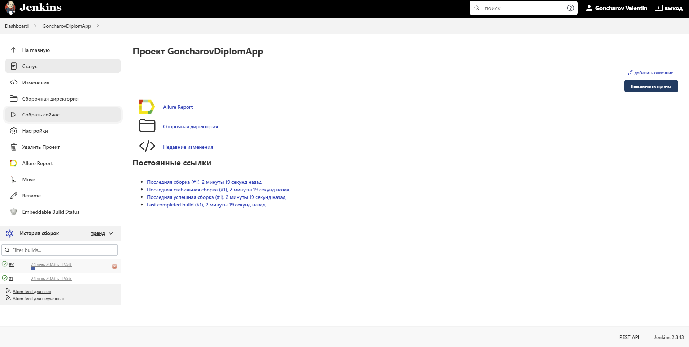

# Диплом автотестирование мобильного приложения Wikipedia

<p align="center">
  
</p>

##	Содержание

- [Технологии и инструменты](#technologist-технологии-и-инструменты)
- [Реализованныe проверки](#bookmark_tabs-реализованные-проверки)
- [Запуск тестов из терминала](#computer-запуск-тестов-из-терминала)
- [Запуск тестов в Jenkins](#-запуск-тестов-в-jenkins)
- [Отчет о результатах тестирования в Allure Report](#-отчет-о-результатах-тестирования-в-Allure-report)
- [Интеграция с Allure TestOps](#-интеграция-с-allure-testops)
- [Уведомления в Telegram с использованием бота](#-уведомления-в-telegram-с-использованием-бота)
- [Пример запуска теста в Browserstack](#-пример-запуска-теста-в-Browserstack)


## :technologist: Технологии и инструменты
<p  align="center">

<code></code>
<code></code>
<code></code>
<code></code>
<code></code>
<code></code>
<code></code>
<code></code>
<code></code>
<code></code>
<code></code>
<code></code>

</p>

## :bookmark_tabs: Реализованные проверки:

- При указании значений в поиске отображается список результатов
- Поиск в приложении: результат соответствует введенным значениям
- Смена языка в момент поиска: результаты верно меняют локализацию

## :computer: Запуск тестов из терминала

### Удаленный запуск тестов

```bash
gradle clean test 
-Denvironment=browserstack
```

### Локальный запуск тестов

```bash
gradle clean test
-Denvironment=local
```

##  Запуск тестов в [Jenkins](https://jenkins.autotests.cloud/job/GoncharovDiplomApp/)

Запуск сборки при нажатии кнопки <code><strong>*Собрать сейчас*</strong></code>.

<p align="center">
  
</p>

После выполнения сборки, в блоке <code><strong>*История сборок*</strong></code> напротив номера сборки отобразятся
иконки *Allure Report* и *Allure TestOPS*, которые по клику открывают страницы соответствующих отчетов.

<p align="center">
  
</p>

##  Отчет о результатах тестирования в [Allure Report](https://jenkins.autotests.cloud/job/GoncharovDiplomApp/2/allure/)

<p align="center">
  
</p>


##  Интеграция с [Allure TestOps](https://allure.autotests.cloud/launch/to do8)

### Основной дашборд

<p align="center">
  
</p>

### Список тестов с результатами прогона

<p align="center">
  
</p>

### Список тест-кейсов, сформированных в результате прогона

<p align="center">
  
</p>

##  Уведомления в Telegram с использованием бота
После завершения сборки специальный бот, созданный в <code>Telegram</code>, автоматически обрабатывает и отправляет сообщение с отчетом о прогоне тестов.

<p align="center">


##  Пример запуска теста в Browserstack

К каждому тесту в отчете прилагается видео.

На данном видео выполняется:

- Проверка изменения языка результатов поиска при смене языка


<p align="center">
  
</p>